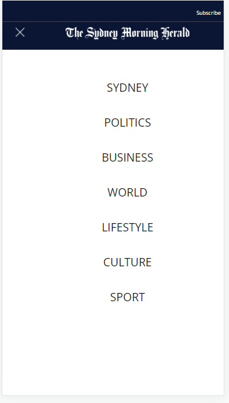
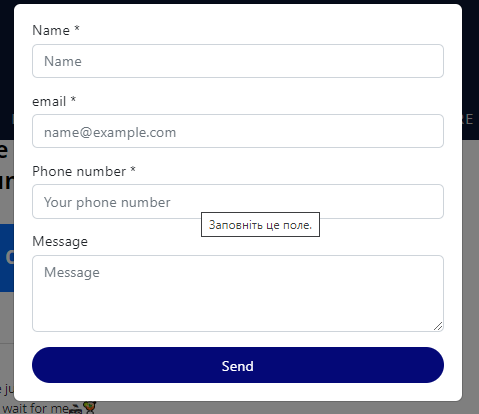
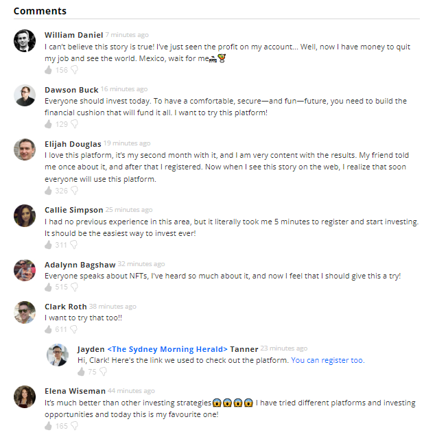

# HOPMO

[Here you can check it](https://artemuholkov.github.io/test-HOPMO/)

---

There was figma design for this project with all font styles and colors, header is my vision.
This landing page is 100% responsive for all types of screens.
I used HTML, CSS, JS in this project.

---

###What was interesting in this project:

1. This project was test for Junior Front End developer at HOPMO dev company.

2. Full screen mobile menu, where burger icon slowly changing to X mark.

3. Modal contact menu with form appears in 1 minute after you enter website.

3. Interesting comments section.

---
